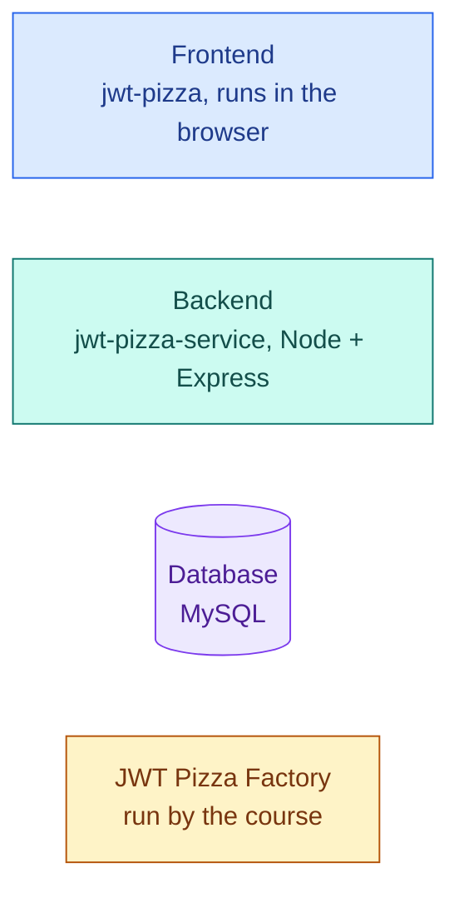

# JWT Pizza docs

How JWT Pizza works, from the whole system down to a single request. Read them in order the first time;
after that, jump straight to what you need.

| Page | What it answers | Zoom level |
| --- | --- | --- |
| [system.md](system.md) | What are the pieces? What is each folder for? Who calls whom? | whole system |
| [frontend.md](frontend.md) | What does every frontend file do? How do pages, routing, and state work? | this repo |
| `docs/README.md` in **jwt-pizza-service** | What does every backend file do? What happens to one request? | the backend repo |
| `docs/database.md` in **jwt-pizza-service** | What tables exist, how do they connect, and which code uses them? | the database |
| [flows.md](flows.md) | For each user activity: which page, which endpoint, which SQL, in what order? | one activity |

The code is annotated as well. Every source file opens with a `@fileoverview` summary, and functions have
`/** ... */` doc comments. In VS Code, hover over a function name anywhere it's used to read its comment.

## Reading the diagrams

The diagrams are [mermaid](https://mermaid.js.org/). GitHub draws them automatically. In VS Code, install the
**Markdown Preview Mermaid Support** extension, then open a doc and press `Ctrl+Shift+V`.

Every diagram uses the same colors for the same layer:

