# User activity flows

The deliverable 1 table in [notes.md](../notes.md), drawn out. Each section covers a group of rows and shows the
order things happen in.

- [How to read these diagrams](#how-to-read-these-diagrams)
- [Pages that never call the backend](#pages-that-never-call-the-backend): home, about, history
- [Logging in, registering, and logging out](#logging-in-registering-and-logging-out): the token's life
- [Close-up: every request after login](#close-up-every-request-after-login)
- [Ordering and verifying a pizza](#ordering-and-verifying-a-pizza)
- [Diner pages](#diner-pages): profile, franchise as a diner
- [Franchisee pages](#franchisee-pages): view franchise, create and close stores
- [Admin pages](#admin-pages): view all, create and close franchises
- [Who is allowed to do what](#who-is-allowed-to-do-what)

## How to read these diagrams

Every request that reaches the backend passes through the same five layers, and every diagram draws all five:

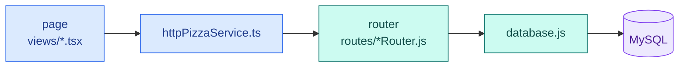

- **Routers never write SQL.** Every query lives in `database.js`, so an arrow into MySQL always comes from
  `database.js`.
- **Requests are drawn hop by hop** (solid arrows). None are skipped.
- **Responses are drawn once** (dashed arrows): from the layer that produced the answer to the next layer that
  does something with it. A layer that only passes the response along isn't drawn. For example, in Login the
  response stops at `httpPizzaService` because it saves the token there, but in most other flows it goes straight
  back to the page.

## Pages that never call the backend

**Rows: View home page, View About page, View History page.**

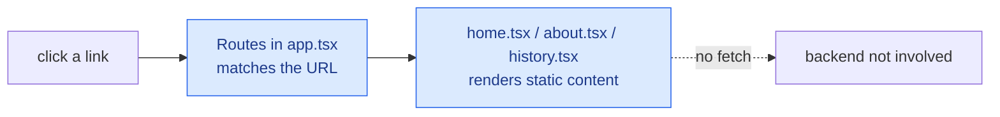

Clicking a link in a React app doesn't reload the page. React Router swaps which component is shown. Open the
browser's **Network** tab while you click these pages: no requests to `localhost:3000` appear.

## Logging in, registering, and logging out

### Login

**Rows: Login new user, Login as franchisee, Login as admin.** The flow is the same for all three; only the roles
that come back differ.

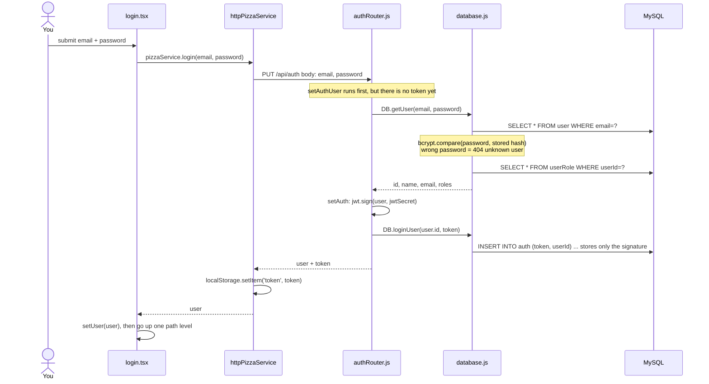

### Register

**Row: Register new user.** Identical to login except for the first half: it creates the user instead of looking
one up.

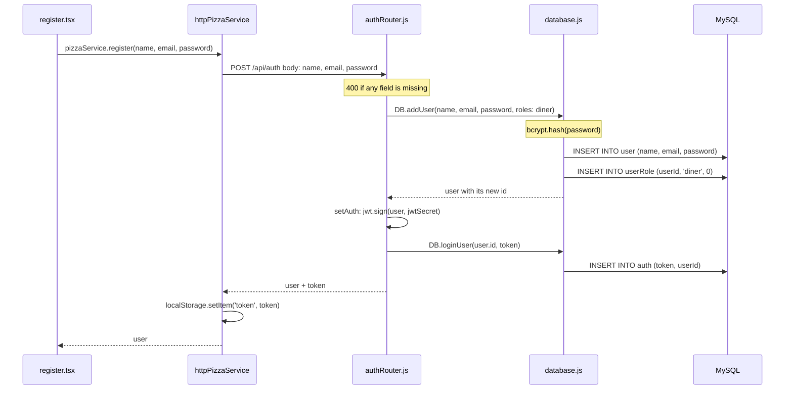

Registering always creates a **diner**. Nothing in the request can make you a franchisee or admin.

### Logout

**Row: Logout.**

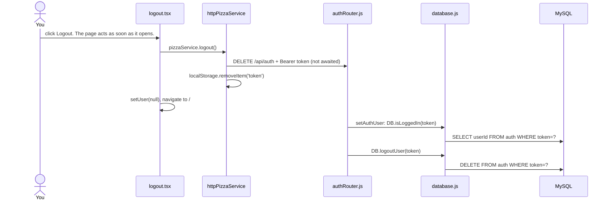

**Why keep tokens in a table at all?** A JWT is valid as long as its signature checks out, so on its own it can't
be cancelled. Deleting the row from `auth` is what makes logout real: the token still has a valid signature, but
`setAuthUser` no longer finds it and treats the request as anonymous.

## Close-up: every request after login

This diagram zooms in on the space between `httpPizzaService` and the router. The other diagrams draw that
space as a single arrow. Every request that carries a token passes through these steps before the route handler
runs, which is why most rows in notes.md begin with `SELECT userId FROM auth WHERE token=?`.

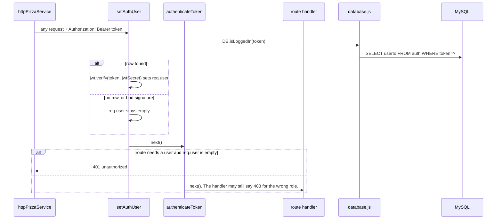

`setAuthUser` is defined in `authRouter.js`, but `service.js` registers it for every request, not just
`/api/auth` ones. `authenticateToken` only runs on routes that list it.

## Ordering and verifying a pizza

**Rows: Order pizza, Verify pizza.**

### What the order object picks up along the way

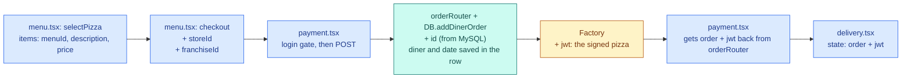

### 1. The menu page loads

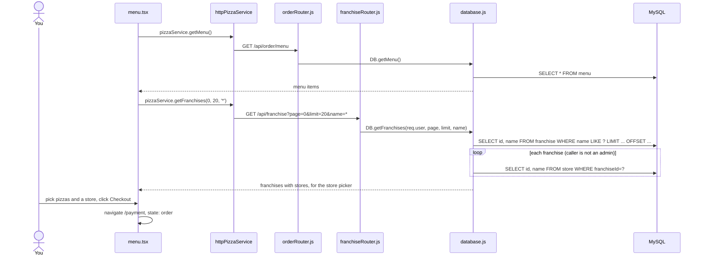

If an admin opens the menu, `getFranchises` loads each franchise's admins and revenue instead (see
[the admin page](#view-the-admin-page)). The picker only uses the store ids and names.

### 2. Paying

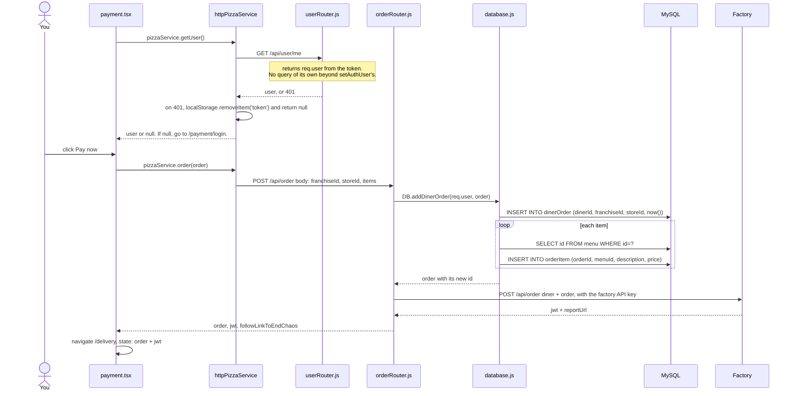

### 3. Verifying

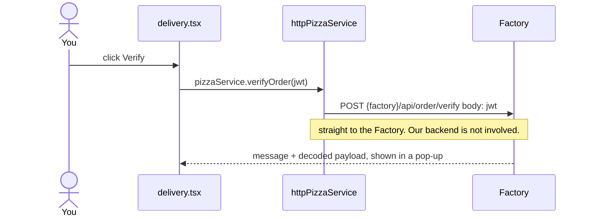

**Things to notice while stepping through:**

- The order is saved in MySQL **before** the Factory is called. If the Factory fails, the order row stays and the
  user gets a 500.
- The prices saved in `orderItem` are the ones the browser sent. The server doesn't look them up from the menu.
- `limit` arrives from the URL as the string `"20"`, so `limit + 1` in `getFranchises` is `"201"`. Put a breakpoint
  there and look at it.

## Diner pages

### View profile page

**Row: View profile page.** Click your initials in the header to open `/diner-dashboard`.

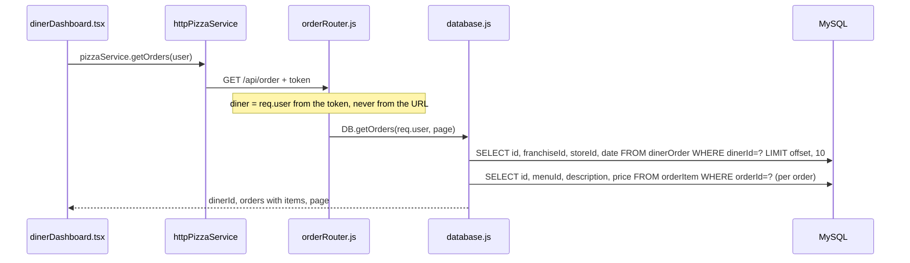

### View franchise as a diner

**Row: View franchise (as diner).**

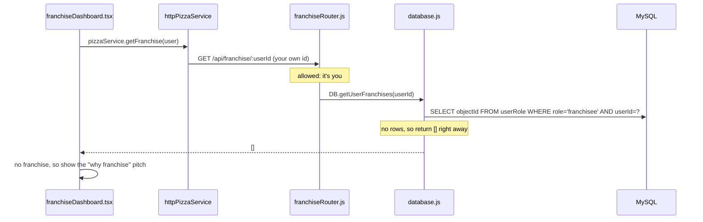

## Franchisee pages

### View franchise as a franchisee

**Row: View franchise (as franchisee).** It starts the same as the diner version, but the first query finds rows,
so the database keeps going.

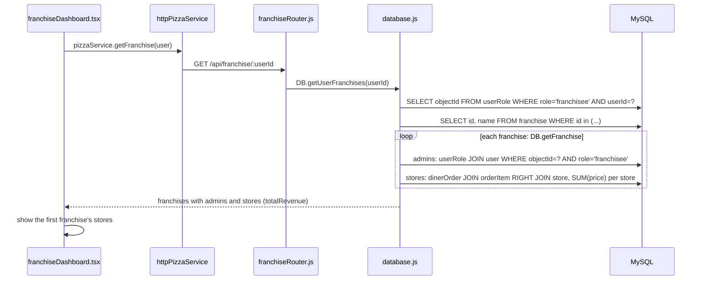

### Create or close a store

**Rows: Create a store, Close a store.** Create store is only reached from the franchise dashboard. Close store is
reached from the franchise dashboard or, for an admin, from the admin dashboard. The permission check needs the
franchise's admin list, so both routes run `DB.getFranchise` first.

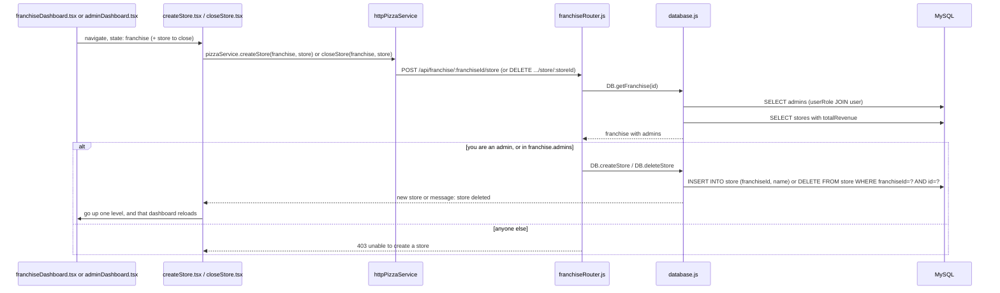

## Admin pages

### View the admin page

**Row: View Admin page.** The request goes out as soon as the page opens, for anyone. The admin check on the page
only decides what to show afterwards.

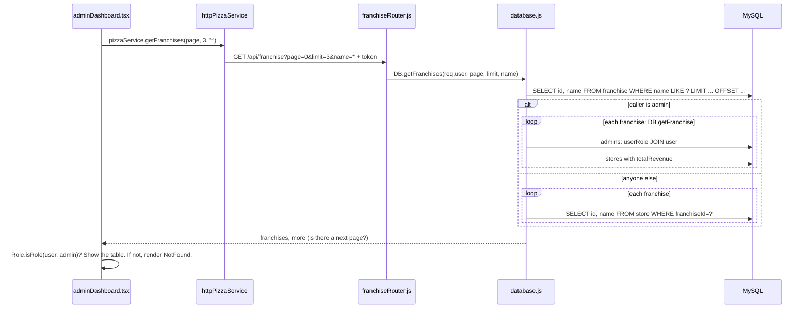

The same endpoint returns less for non-admins: store ids and names, with no admins and no revenue. Hiding the
page with `NotFound` protects nothing. The backend's reply is what keeps the admin data private.

### Create a franchise

**Row: Create a franchise for t@jwt.com.**

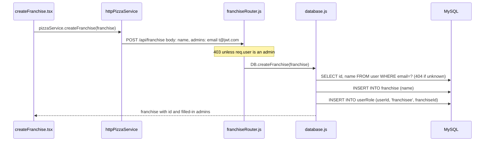

t@jwt.com's token still says "diner" until they log in again, because tokens are snapshots. The franchise dashboard
still works for them right away: `getUserFranchises` reads `userRole` from the database, not from the token.

### Close a franchise

**Row: Close the franchise for t@jwt.com.**

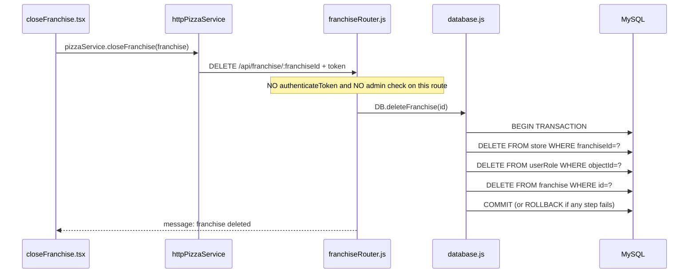

## Who is allowed to do what

Permission is checked in two places, and only one of them actually protects anything:

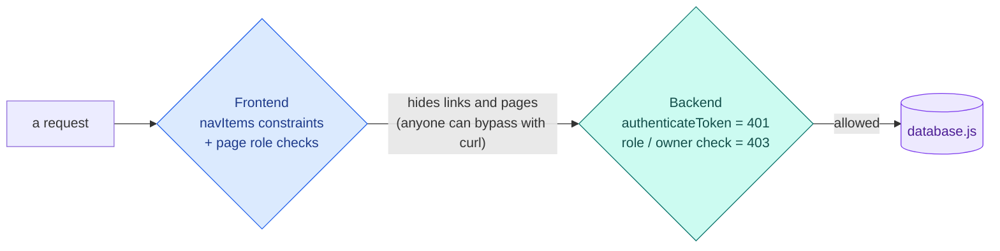

What the **backend** enforces:

| Action | Not logged in | Diner | Franchisee | Admin |
| --- | --- | --- | --- | --- |
| See menu, list franchises | ✅ | ✅ | ✅ | ✅ (also sees admins and revenue) |
| Order, see own orders | 401 | ✅ | ✅ | ✅ |
| See a user's franchises | 401 | own only (else `[]`) | own only | anyone's |
| Create or close a store | 401 | 403 | ✅ only in their own franchise | ✅ |
| Create a franchise, add menu item | 401 | 403 | 403 | ✅ |
| **Close a franchise** | ⚠️ allowed | ⚠️ allowed | ⚠️ allowed | ✅ |

The ⚠️ row is a deliberate hole in the course code: `DELETE /api/franchise/:franchiseId` never checks who is
calling. Later deliverables have you find and fix holes like this one.
