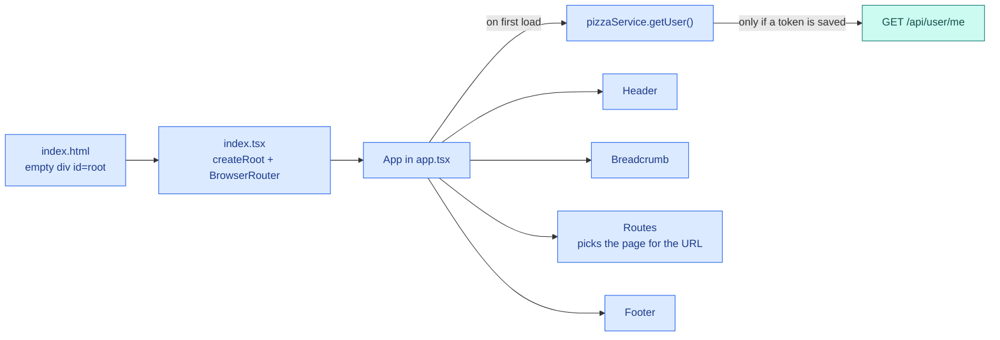
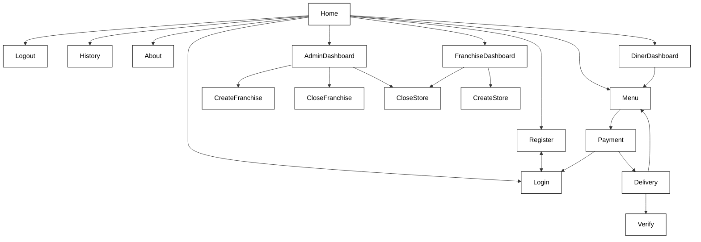
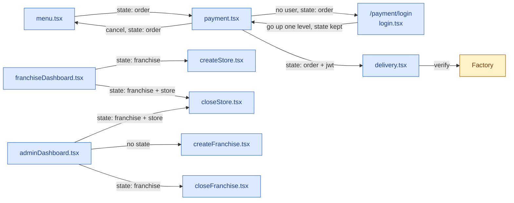
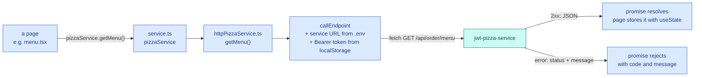

# The frontend (jwt-pizza)

React + TypeScript, bundled and served by Vite, styled with Tailwind and Preline.

## Every file in one line

```text
jwt-pizza/
├── index.html               The single HTML page. Has an empty <div id="root"> and loads index.tsx.
├── index.tsx                Starts React: puts <App> inside <BrowserRouter> and mounts it into #root.
├── main.css                 Turns on Tailwind; a few global styles.
├── tailwind.config.js       Where Tailwind looks for class names; adds the Preline plugin and a wobble animation.
├── postcss.config.js        Runs Tailwind and autoprefixer when CSS is built.
├── tsconfig.json            TypeScript settings (strict mode, classic React JSX).
├── package.json             Dependencies and the npm scripts: dev, build, preview.
├── package-lock.json        Exact dependency versions (generated; don't edit).
├── .env.development         Service and Factory URLs used by `npm run dev` (backend = localhost:3000).
├── .env.production          Service and Factory URLs used by `npm run build`.
├── .gitignore               Files git ignores (node_modules, dist, private notes).
├── deployService.sh         Old manual deploy: build, then copy to a server over ssh. Replaced by CI later.
├── notes.md                 Deliverable 1 table: activity → page → endpoint → SQL.
├── incidentReports/
│   └── template.md          Report template for the chaos-testing deliverable.
├── docs/                    These docs.
├── public/                  Served as-is at the site root:
│   ├── pizza*.png, *.jpg    menu and home page images
│   ├── jwt-pizza-*.png      logo and browser icon
│   ├── robots.txt           tells search engines what to crawl
│   └── version.json         the version number the footer shows (CI replaces it)
├── README.md, LICENSE, forkRepo.png   Course readme, license, and the image the readme uses.
├── CLAUDE.md                Project context for AI-assisted work.
└── src/
    ├── app/
    │   ├── app.tsx          The hub: holds the logged-in user; navItems lists every page, route, and link rule.
    │   ├── header.tsx       Top nav links (filtered by navItems rules) and the user's initials.
    │   └── footer.tsx       Footer links and the version number.
    ├── service/
    │   ├── pizzaService.ts  Data types (User, Order, Franchise...) and the PizzaService interface.
    │   ├── httpPizzaService.ts  The real PizzaService: one fetch per method, adds the login token.
    │   └── service.ts       Hands pages the pizzaService to use (the swap point for tests).
    ├── views/               One file per page:
    │   ├── home.tsx         `/`: carousel, quotes, "Order now".
    │   ├── about.tsx        `/about`: static.
    │   ├── history.tsx      `/history`: static.
    │   ├── login.tsx        `/login`: PUT /api/auth.
    │   ├── register.tsx     `/register`: POST /api/auth.
    │   ├── logout.tsx       `/logout`: DELETE /api/auth as soon as it opens.
    │   ├── menu.tsx         `/menu`: pick pizzas and a store, builds the order.
    │   ├── payment.tsx      `/payment`: login gate, then POST /api/order.
    │   ├── delivery.tsx     `/delivery`: shows the pizza JWT and verifies it with the Factory.
    │   ├── dinerDashboard.tsx      `/diner-dashboard`: your info and order history.
    │   ├── franchiseDashboard.tsx  `/franchise-dashboard`: your franchise's stores and revenue.
    │   ├── adminDashboard.tsx      `/admin-dashboard`: all franchises (admin only).
    │   ├── createStore.tsx         form: add a store.
    │   ├── closeStore.tsx          confirm: close a store.
    │   ├── createFranchise.tsx     form: create a franchise.
    │   ├── closeFranchise.tsx      confirm: close a franchise.
    │   ├── docs.tsx         `/docs`: lists the API endpoints.
    │   ├── notFound.tsx     Shown for unknown URLs.
    │   └── view.tsx         The page frame with the big orange title that every page uses.
    ├── components/
    │   ├── breadcrumb.tsx   The "home > admin-dashboard > ..." trail.
    │   ├── button.tsx       The orange button.
    │   ├── card.tsx         Image + title + description card (a menu pizza).
    │   ├── carousel.tsx     Auto-playing slideshow.
    │   ├── slide.tsx        One slideshow image.
    │   └── quote.tsx        A styled customer quote.
    ├── hooks/
    │   └── appNavigation.tsx  useBreadcrumb(): navigate "up" one path level, keeping location.state.
    └── icons.tsx            SVG icons as components.
```

## How the app starts



Refreshing the page wipes React's memory, but the token survives in `localStorage`, so `getUser()` asks the
backend who that token belongs to and restores the user.

## navItems: one list drives routes, header, and footer

Every page is one entry in the `navItems` array in `src/app/app.tsx`. `<Routes>` turns each entry into a route; the
header and footer each show the entries whose `display` includes them, and only when every `constraints` function
returns true.

| Page | URL (`to`) | Link appears in | Link shown when |
| --- | --- | --- | --- |
| Home | `/` | none (logo area) | always |
| Diner | `/diner-dashboard` | none (click your initials) | logged in |
| Order | `/menu` | header | always |
| Franchise | `/franchise-dashboard` | header, footer | not an admin |
| About | `/about` | footer | always |
| History | `/history` | footer | always |
| Admin | `/admin-dashboard` | header | admin |
| Create/Close franchise, Create/Close store | `/:subPath?/create-franchise` etc. | none (buttons) | — |
| Payment, Delivery | `/payment`, `/delivery` | none (order flow) | — |
| Login, Register | `/:subPath?/login`, `/:subPath?/register` | header | logged out |
| Logout | `/:subPath?/logout` | header | logged in |
| Docs | `/docs/:docType?` | none (type the URL) | — |
| Opps | `*` (anything else) | none | — |

**Two things to remember:**

- **`:subPath?`** is an optional first URL segment. Login works at `/login` and also at `/payment/login`, and
  when it finishes it goes up one level, back to `/payment`.
- **Constraints only hide links.** Every route always exists, so anyone can type `/admin-dashboard`. The page
  checks the role itself and shows NotFound, and the backend refuses the data anyway. The backend is the real
  lock; the frontend just tidies up the menu.

## How pages move between each other

The course's page map, from [instruction/jwtPizza](https://github.com/devops329/devops/blob/main/instruction/jwtPizza/jwtPizza.md):



The same map showing **what each move carries**. Pages hand data to the next page through react-router's
`location.state` (the second argument to `navigate(path, { state })`), not through a global store:



## How a page talks to the backend



## Where each kind of state lives

| State | Where it's kept | Lifetime |
| --- | --- | --- |
| The logged-in user | `useState` in `App`, passed down as a `user` prop | until page refresh (then restored from the token) |
| The login token | `localStorage['token']` | until logout, or until the backend rejects it |
| An order, franchise, or store being passed to the next page | `location.state` | that navigation only |
| Data a page loaded (menu, franchises, orders) | that page's own `useState` | while the page is shown |
