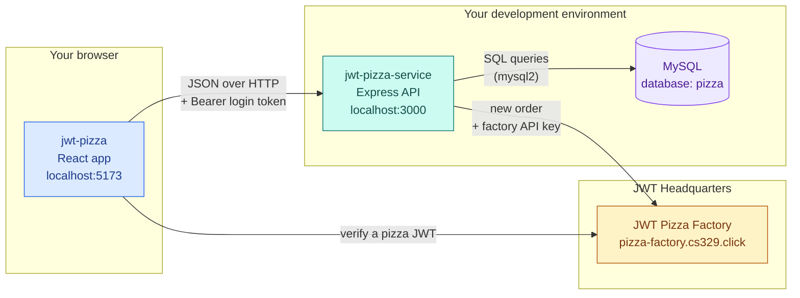
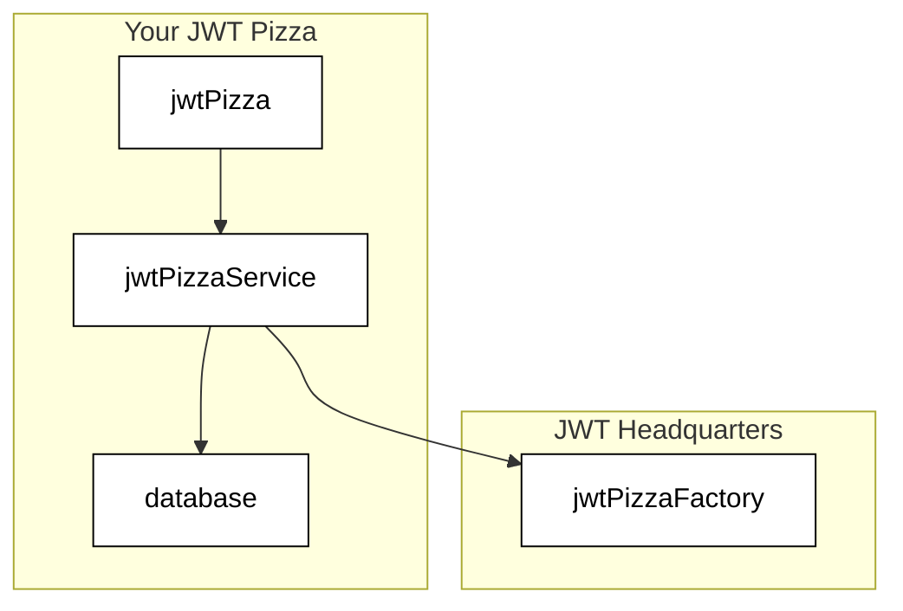
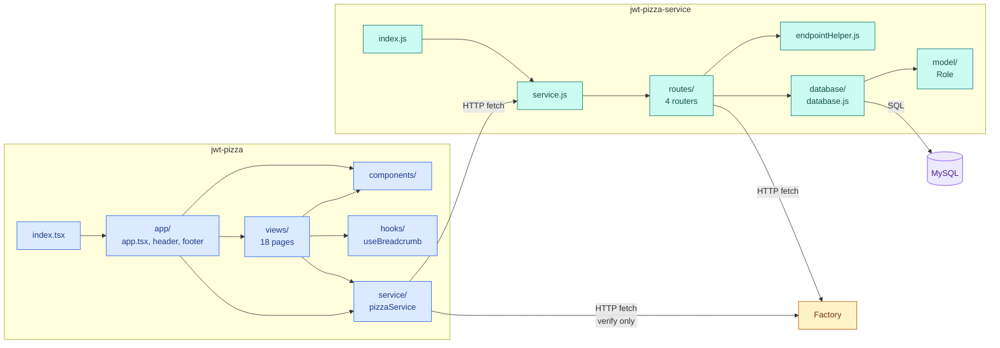

# The whole system

## The four pieces

JWT Pizza is two programs you run, one database, and one outside service.



| Arrow | What travels across it | Where in the code |
| --- | --- | --- |
| Frontend → Backend | JSON requests. After login, every request also carries `Authorization: Bearer <token>`. | `callEndpoint` in `src/service/httpPizzaService.ts` |
| Backend → MySQL | SQL, one new connection per database method | `jwt-pizza-service/src/database/database.js` |
| Backend → Factory | The diner and order, authenticated with the **service's** factory API key, not the user's token | `POST /api/order` in `jwt-pizza-service/src/routes/orderRouter.js` |
| Frontend → Factory | The pizza JWT, to check it's genuine. The backend is not involved. | `verifyOrder` in `httpPizzaService.ts` |

### The course's version of this diagram

From [instruction/jwtPizza](https://github.com/devops329/devops/blob/main/instruction/jwtPizza/jwtPizza.md).
It leaves out the browser → Factory arrow, which is only used when you press **Verify**.



## What each folder is for

Two repositories, shown side by side. Only the folders that hold code or matter to you are listed. Every file
gets its own line in [frontend.md](frontend.md) and in `docs/README.md` of jwt-pizza-service.

```text
jwt-pizza/                      FRONTEND: the website people click on
├── index.html                  the one HTML page; loads index.tsx
├── index.tsx                   starts React
├── public/                     files served as-is: pizza images, version.json
├── src/
│   ├── app/                    the shell: routing table (app.tsx), header, footer
│   ├── views/                  one file per page (menu, login, admin dashboard...)
│   ├── components/             small reusable pieces pages are built from (button, card...)
│   ├── hooks/                  reusable React logic (breadcrumb navigation)
│   ├── service/                the ONLY code that talks to the backend
│   └── icons.tsx               SVG icons
├── docs/                       these docs
└── notes.md                    deliverable 1 table: activity → page → endpoint → SQL

jwt-pizza-service/              BACKEND: the API the website calls
├── src/
│   ├── index.js                starts the server on port 3000
│   ├── service.js              builds the Express app and plugs in the routers
│   ├── endpointHelper.js       error type + async wrapper every router uses
│   ├── routes/                 one file per URL group: /api/auth, /api/user, /api/order, /api/franchise
│   ├── database/               ALL the SQL: database.js (queries) and dbModel.js (tables)
│   ├── model/                  the Role names (diner, franchisee, admin)
│   └── config.js               secrets: JWT secret, DB password, factory key (not committed)
├── scripts/                    local helpers: run both apps, seed test data
└── docs/                       backend docs
```

## Who calls whom

Arrows point from the caller to the code it calls. Each layer only talks to the layer next to it: pages never
write SQL, and routers never touch the browser.



**The three rules this picture shows:**

1. **`src/service/` is the frontend's only door to the network.** To find every backend call the app can make, read
   `httpPizzaService.ts`.
2. **`routes/` decide who is allowed; `database/` does the work.** Permission checks and HTTP status codes live in
   the routers; SQL lives only in `database.js`.
3. **The Factory is called from two places.** The backend calls it to create a pizza, and the browser calls it to
   verify one.
